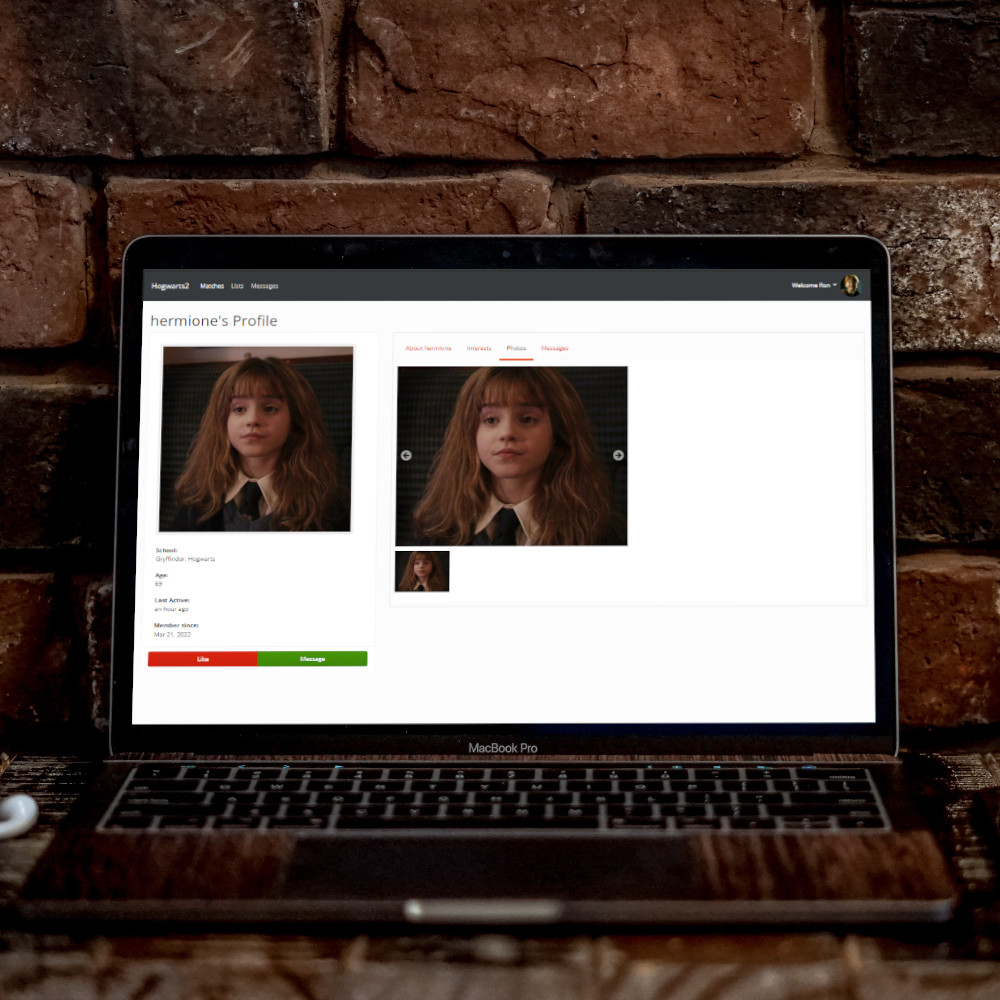

<div id="top"></div>

<!-- PROJECT LOGO -->
<br />
<div align="center">
  <a href="https://github.com/ronaldosena/amortentia/commits/">
    
  </a>

  <h3 align="center">Amortentia</h3>

  <p align="center">
    Even more potent than amortentia!
    <br />
    <a href="https://github.com/ronaldosena/amortentia/commits/"><strong>Explore the code »</strong></a>
    <br />
    <br />
    <a href="https://github.com/ronaldosena/amortentia/assets/amortentia.jpg">View Demo</a>
    ·
    <a href="https://github.com/ronaldosena/amortentia/issues">Report Bug</a>
    ·
    <a href="https://github.com/ronaldosena/amortentia/LICENSE.md">View License</a>
  </p>
</div>

## About The Project

[![Chess app][demo-gif]](https://github.com/ronaldosena/amortentia)

A fun side project for my own amusement. Well, not everything has to be solved with magic, a bit of tech can be just as (if not more) effective than amortentia!

### Built With

- [.NET](https://dotnet.microsoft.com/)
- [Angular](https://angular.io/)
- [Cloudinary](https://cloudinary.com/)

## Getting Started

### Installation & Usage

1. Get a free API Key at [Cloudinary](https://cloudinary.com/documentation)
2. Clone the repo
   ```sh
   git clone https://github.com/ronaldosena/amortentia.git
   ```
3. |Make sure have Node.JS version 10 (required by angular 6)
   ```sh
   node -v
   ```
4. Install dependencies
   ```sh
   npm install
   ```

## Roadmap

- [x] Project kick-off
- [ ] Improve user interface and experience
- [ ] Implement messaging

<!-- CONTRIBUTING -->

## Contributing

Contributions are what make the open source community such an amazing place to learn, inspire, and create. Any contributions you make are **greatly appreciated**.

If you have a suggestion that would make this better, please fork the repo and create a pull request. You can also simply open an issue with the tag "enhancement".
Don't forget to give the project a star! Thanks again!

1. Fork the Project
2. Create your Feature Branch (`git checkout -b feature/AmazingFeature`)
3. Commit your Changes (`git commit -m 'Add some AmazingFeature'`)
4. Push to the Branch (`git push origin feature/AmazingFeature`)
5. Open a Pull Request

<!-- LICENSE -->

## License

Distributed under the Coffeware License. See [`LICENSE.md`](https://github.com/ronaldosena/amortentia/LICENSE.md) for more information.

<!-- CONTACT -->

## Contact

You can reach me out at [@roronalds\_](https://twitter.com/roronalds_) or send an e-mail to ronaldo.sena@outlook.com

<p align="right"><a href="#top">back to top</a></p>

<!-- MARKDOWN LINKS & IMAGES -->

[demo-gif]: assets/amortentia.gif
